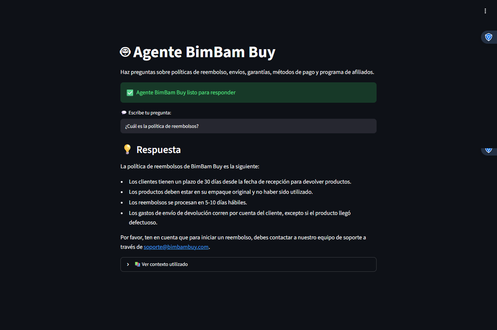

# 🤖 Agente BimBam Buy - Challenge Alura Agente

Agente de inteligencia artificial conversacional para responder preguntas sobre la documentación de BimBam Buy usando Llama 3.1 vía Groq API.

---

## 🌐 Aplicación en Vivo

🔗 **URL del deploy:** [https://challenge-alura-agente.onrender.com/](https://challenge-alura-agente.onrender.com/)

&gt; ⚠️ **Nota:** El plan gratuito de Render "se duerme" después de 15 minutos de inactividad. La primera carga puede tardar 30-50 segundos.

---

## 🎯 Sobre el Proyecto

BimBam Buy es un e-commerce multiplataforma. Este agente permite a cualquier persona hacer preguntas sobre políticas de reembolso, envíos, garantías, métodos de pago y programa de afiliados sin necesidad de abrir los documentos.

### Decisión de Arquitectura: De RAG a Contexto en Memoria

El challenge original proponía una arquitectura **RAG** (Retrieval-Augmented Generation) usando:
- Carga de PDFs con `PyPDFLoader`
- Embeddings con `HuggingFace` (all-MiniLM-L6-v2)
- Vector Store con `ChromaDB`
- LLM con `Google Gemini`

Sin embargo, durante el desarrollo surgieron dos limitaciones críticas:

1. **Los archivos PDF pesaban demasiado** para subirlos al repositorio de GitHub (límite de tamaño por archivo).
2. **El plan gratuito de Render solo ofrece 512 MB de RAM**, insuficiente para cargar ChromaDB + HuggingFace embeddings + el modelo.

**Solución implementada:** Se extrajo el contenido textual de los 5 documentos PDF de BimBam Buy y se cargó directamente en memoria como un string de contexto dentro del prompt. Esto simplificó la arquitectura, eliminó dependencias pesadas y permitió el deploy exitoso en el tier gratuito, manteniendo la funcionalidad completa del agente.

---

## 📸 Demostración Visual

El agente responde preguntas de manera clara, concisa y profesional basándose en la documentación de BimBam Buy.

---

## ✨ Características Técnicas Principales

- **🧠 Contexto en Memoria:** Los 5 documentos de BimBam Buy (reembolsos, afiliados, métodos de pago, envíos, garantías) se cargan como contexto en el prompt, permitiendo respuestas precisas sin necesidad de base de datos vectorial.
- **💬 Interfaz Conversacional:** Frontend interactivo desarrollado con Streamlit, con campo de entrada, indicador de "pensando" y visualización de respuestas en formato Markdown.
- **⚡ Integración con Groq API:** Conexión directa a la API de Groq para acceder al modelo Llama 3.1 8B de forma gratuita y con latencia ultrabaja.
- **🔍 Transparencia de Fuentes:** Incluye un panel expandible "Ver contexto utilizado" para que el usuario pueda verificar la información base de cada respuesta.
- **☁️ Deploy en Render:** Configuración optimizada para el plan gratuito de Render con variables de entorno seguras.
- **🛡️ Manejo de Errores:** Validación de API Key y captura de excepciones para evitar que la app se caiga.

---

## 🏗️ Stack Tecnológico

| Capa | Tecnología | Descripción |
|------|-----------|-------------|
| **Frontend** | Streamlit | Interfaz web interactiva para el chatbot |
| **LLM** | Llama 3.1 8B (vía Groq API) | Modelo de lenguaje gratuito y rápido |
| **Framework** | Python 3.10+ | Lógica de la aplicación |
| **Contexto** | Documentos en memoria | Información de BimBam Buy cargada en el prompt |
| **Deploy** | Render (Free Tier) | Plataforma de hosting gratuita |
| **API Key** | Groq | Proveedor de API para modelos LLM gratuitos |

---

## 📁 Estructura del Proyecto

challenge-alura-agente/
- README.md                 # Este archivo
- requirements.txt          # Dependencias del proyecto
- app.py                    # Aplicación principal (Streamlit + Groq)
- bim_bam_buy_agent.ipynb   # Notebook original del desarrollo
- data/                     # Documentos PDF de BimBam Buy
  - afiliados.pdf
  - manual_garantias.pdf
  - preguntas_frecuentes.pdf
  - reembolsos_devoluciones.pdf
  - tiempos_costos.pdf
- agente_bimbam.jpg         # Captura de la interfaz
- respuesta.png             # Evidencia del deploy funcionando

## 🚀 Guía de Instalación Local

Sigue estos pasos para ejecutar el proyecto en tu computadora.

### 1. Clonar el repositorio

git clone https://github.com/caroiglesias/challenge-alura-agente.git
cd challenge-alura-agente

### 2. Crear entorno virtual (Recomendado)

python -m venv venv

En Windows:
venv\Scripts\activate

En Mac/Linux:
source venv/bin/activate

### 3. Instalar dependencias

pip install -r requirements.txt

### 4. Configurar variables de entorno

Crea un archivo .env en la raíz del proyecto o exporta la variable directamente:

export GROQ_API_KEY="tu-clave-de-groq-aqui"

Obtén tu API Key gratuita en: https://console.groq.com/keys

### 5. Ejecutar la aplicación

streamlit run app.py

La aplicación se abrirá automáticamente en tu navegador en: http://localhost:8501

## 🌐 Deploy en Render

### Pasos para desplegar:

1. Conecta tu repositorio de GitHub a Render
2. Configura:
   - Build Command: pip install -r requirements.txt
   - Start Command: streamlit run app.py
3. Agrega la variable de entorno GROQ_API_KEY
4. Listo! Render hara el deploy automaticamente

